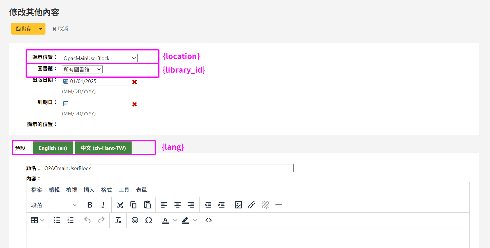

# Koha HTML 自訂內容 REST API

將 Koha 系統後台「HTML 自訂內容」所設定的內容，透過自訂 REST API 端點對外提供，方便其他網站或系統取得並顯示 Koha 的自訂 HTML 內容。


## REST API 使用說明

```
/api/v1/contrib/opacblock/block/{location}?lang={lang}&library_id={library_id}
```

| 變數/參數           | 必填 | 說明                                                      |
| ------------ | -- | ------------------------------------------------------- |
| {location} | 是  | 顯示位置代碼，例如 `OpacMainUserBlock`。 |
| {lang}       | 否  | 語言代碼，例如 `zh-Hant-TW`，預設為 `default`。 |
| {library_id} | 否  | 圖書館代碼，例如 `CPL`，預設為 `NULL`。 |


範例：

```
/api/v1/contrib/opacblock/block/OpacMainUserBlock
```

```
/api/v1/contrib/opacblock/block/OpacMainUserBlock?lang=zh-Hant-TW&library_id=CPL
```




## {location} 對照表

| {location} 值 | 用途 |
| ---------------------------------------------- | -------------- |
| `OpacMainUserBlock`                            | OPAC 首頁主要訊息區塊  |
| `OpacNav`                                      | OPAC 導覽列上方訊息   |
| `OpacNavBottom`                                | OPAC 導覽列下方訊息   |
| `OpacNavRight`                                 | OPAC 導覽列右側訊息   |
| `opacheader`                                   | OPAC 頁首        |
| `opaccredits`                                  | OPAC 頁尾版權／致謝資訊 |
| `OpacLoginInstructions`                        | 登入頁說明文字        |
| `OpacLibraryInfo`                              | 圖書館代碼分館資訊說明 |
| `OpacMaintenanceNotice`                        | 系統維護公告         |
| `OpacSuggestionInstructions`                   | 採購建議說明         |
| `OpacSuppressionMessage`                       | 隱藏館藏提示訊息       |
| `OpacMoreSearches`                             | 更多查詢入口         |
| `OpacCustomSearch`                             | 自訂查詢           |
| `OPACResultsSidebar`                           | 查詢結果側邊欄        |
| `ArticleRequestsDisclaimerText`                | 文獻複印申請免責聲明     |
| `CatalogConcernHelp`                           | 館藏問題回報說明       |
| `CatalogConcernTemplate`                       | 館藏問題回報範本       |
| `ILLModuleCopyrightClearance`                  | 館際互借著作權聲明      |
| `PatronSelfRegistrationAdditionalInstructions` | 讀者自助註冊補充說明     |
| `SCOMainUserBlock`                             | 自助借還書機首頁訊息     |
| `SelfCheckInMainUserBlock`                     | 自助借還書機首頁訊息     |
| `SelfCheckHelpMessage`                         | 自助借還書機說明       |
| `CookieConsentBar`                             | Cookie 同意提示列   |
| `CookieConsentPopup`                           | Cookie 同意提示視窗  |


